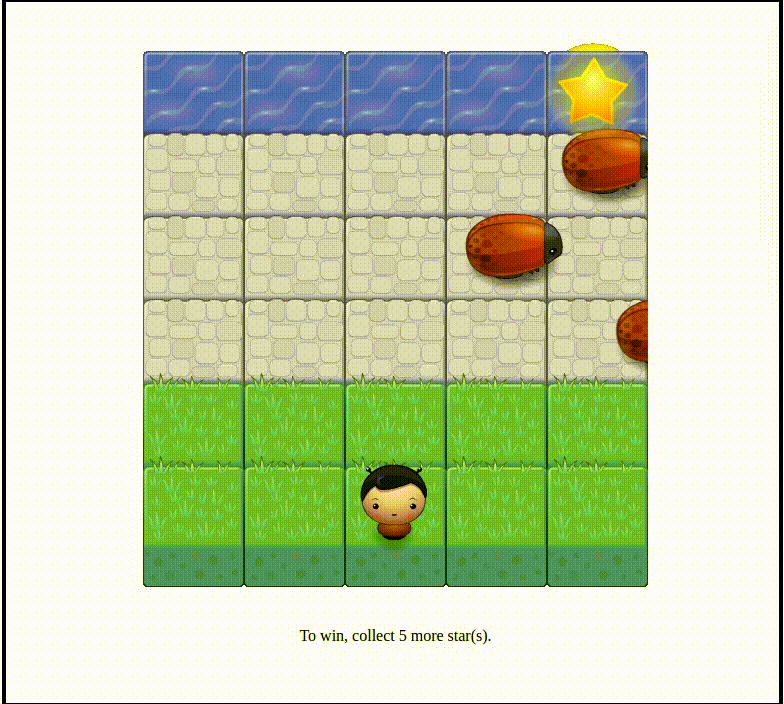

#Intro
Welcome to Arcade Game.
This is a web game written in Javascript using Canvas and HTML/CSS. 

<<<<<<< HEAD

||||||| merged common ancestors
Students should use this [rubric](https://review.udacity.com/#!/projects/2696458597/rubric) for self-checking their submission. Make sure the functions you write are **object-oriented** - either class functions (like Player and Enemy) or class prototype functions such as Enemy.prototype.checkCollisions, and that the keyword 'this' is used appropriately within your class and class prototype functions to refer to the object the function is called upon. Also be sure that the **readme.md** file is updated with your instructions on both how to 1. Run and 2. Play your arcade game.
=======
##Installation Guide
1. Download the entire file.
2. Open index.html
3. Play the game!
>>>>>>> d5df4f6ad26045b0ff8e59e4d12f60576a57a7d6

<<<<<<< HEAD
##Installation Guide
1. Download the entire file.
2. Open index.html
3. Play the game!

##User Guide
 Use **arrow key** on your keyboard to move your character.
   
 **To win**, collect the star floating in the river.  
 If you collect **5 stars**, you win!  
 _**But everytime the bugs bump into you, you have to start over.**_
||||||| merged common ancestors
For detailed instructions on how to get started, check out this [guide](https://docs.google.com/document/d/1v01aScPjSWCCWQLIpFqvg3-vXLH2e8_SZQKC8jNO0Dc/pub?embedded=true).
=======
##User Guide
 Use **arrow key** on your keyboard to move your character.
   
 **To win**, collect the star floating in the river.  
 If you collect **5 stars**, you win!  
 _**But everytime the bugs bump into you, you have to start over.**_
>>>>>>> d5df4f6ad26045b0ff8e59e4d12f60576a57a7d6
